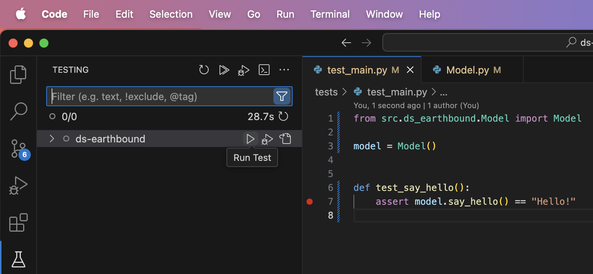

# Ticat

```bash
ds-ticat
│
│
├── README.md.jinja

├── infrastructure
│   ├──  containers                  # Contains utils and code required to run model in container and test
│   ├──  sagemaker                  # Builds a sagemaker endpoint from our model
│   ├──  lambda                  # Builds a lambda endpoint from our model
│   └── ecr                  # Builds a storage repo for our docker images.
│
├── docs                       # Store any files required for documentation
│   └── images
│
├── notebooks
│   └── project_explorer.ipynb             # Preconfigured notebook for testing code in src
│
├── .project_setup_scripts                   # Small scripts needed for project generation
│   └── project_init.sh
│
├── pyproject.toml                    # Project wide configuration (dependencies, linting, etc.)
│
├── data                      # Any artifacts used for model training can be stored here and will be copied into containers
│
├── models                     # This is where the outputs of model training are programmed to go
│
├── src                       # Add your new source code here
│   └── ds_ticat
│
├── src_labs                      # Holds experimental code which is barred from production. Not code reviewed
│
├── test                      # All tests should go here, configured in pytest
│   └── test_main.py
│
├── .copier_answers.yml                 # Answers stored from previous project creation, DO NOT EDIT
│
├── .pre-commit-config.yaml                # Configure the workflows that run before committing is allowed
│
├── .vscode                     # Settings file for the VSCode editor, configures your terminal and notebook settings
│   ├── [settings.json](./.vscode/settings.json)
│   └── [launch.json](./.vscode/launch.json)
│   └── [extensions.json](./.vscode/extensions.json)      # Creates a list of suggested extensions to users
│
└── .gitignore
```


## Quick start
You've just created a new project, a few things should have been done for you:
- Your first commit was created
- Your dependencies were downloaded
- Your VSCode env was configured (see ./.vscode)


```bash
(base) > which python
~/workplace/ds-your-project/.pixi/envs/default/bin/python
```
A result showing python is installed in your pixi folder should appear as shown above.

##Workflow

This project has some guardrails in place in order to keep code quality consistent across the team. Currently
this means:
    - Pre-commit workflows
    - linting

and will extend to include
    - in-IDE checking for spellcheck, security and logic errors.

to disable pre-commit while you're iterating on your own branch, just use:

```
git commit --no-verify -m "Your commit message"
```


Pre-commit


Just remember that these same workflows are enforced at the repository level, so they give you a
good feedback tool before creating a new pull request.


## IDE Setup

You can open the project in VSCode and your python environment should be ready to go.

> Note: Other IDEs will of course work, we'll just need to add some default configs as the use case comes up.

You can try out notebooks by opening the project explorer [here](./notebooks/project_explorer.ipynb)

Your terminal should come pre-configured to use the python environments created by pixi. You can check this
by running the following

#### VS Code Terminal & Notebooks

Your terminal should set up automatically 🤞

If not, check in [settings.json](./.vscode/settings.json) & [launch.json](./.vscode/launch.json) for changing programmatic settings for the workspace.


#### Recommended VS Code Plugins

Find the full list [here](./.vscode/extensions.json)

## Features

* [Pixi Dependency Management](https://pixi.sh/latest/basic_usage/)
* [Updatable Templates](https://copier.readthedocs.io/en/stable/updating/)

## Credits

This package was created with the [Data Science Python Project Template](https://github.com/sevdesk/ds-python-project-template) and [Copier](https://copier.readthedocs.io/en/stable/)


## Contact
[Data Science](https://sevdesk.atlassian.net/wiki/spaces/DATA/pages/4630970588/Data+Science)


#### Testing

Testing is handled with Pytest. Still the most popular, and no python competitors in sight. You can run the tests by clicking on the beaker on the left hand side:



From there, you should see all tests discovered by in the project (just one to start). Press the 'Play' buttons to run your tests.


## Features

* [Pixi Dependency Management](https://pixi.sh/latest/basic_usage/)
* [Updatable Templates](https://copier.readthedocs.io/en/stable/updating/)

## Credits

This package was created with the [Data Science Python Project Template](https://github.com/sevdesk/ds-python-project-template) and [Copier](https://copier.readthedocs.io/en/stable/)


## Contact
[Data Science](https://sevdesk.atlassian.net/wiki/spaces/DATA/pages/4630970588/Data+Science)
